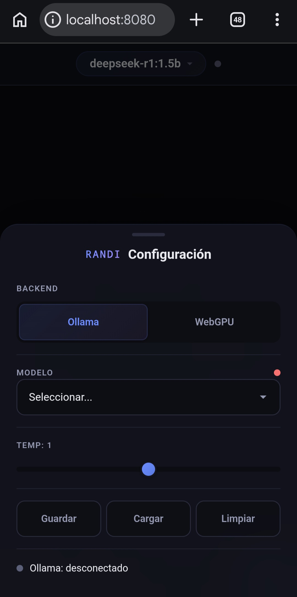
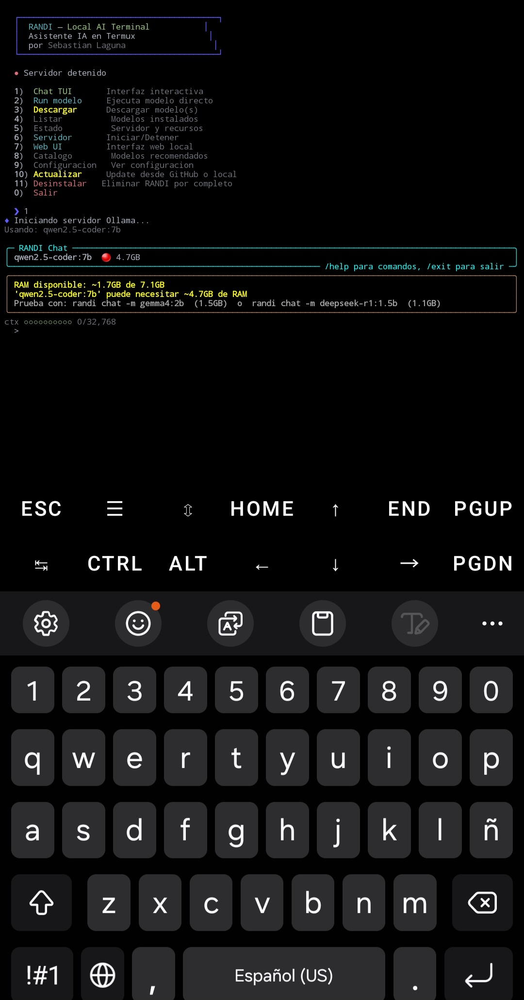

# RANDI 🤖

[](https://github.com/sebastianl1/randi_IA/releases)
[](https://github.com/sebastianl1/randi_IA/stargazers)
[](https://opensource.org/licenses/MIT)
[]()
[]()

**RANDI** — Asistente de IA local para Termux en Android, Linux, macOS y Windows (WSL2 / Git Bash).
Ejecuta modelos de lenguaje (LLMs) como DeepSeek, Qwen, Gemma y otros directamente en tu dispositivo, sin conexion a internet ni consumo de tokens. Incluye chat TUI, interfaz web con WebGPU, vision (chat con imagenes), texto a voz y generacion de imagenes.

## Requisitos

| Requisito | Minimo | Recomendado |
|-----------|--------|-------------|
| RAM | 4GB | 8GB+ |
| Almacenamiento | 3GB libres | 10GB+ |
| SO | Android 11+, Linux, macOS, Windows | Ultima version |
| Termux (Android) | Desde F-Droid | Ultima version |
| Arquitectura | ARM64 | ARM64 |

> **Importante (Android):** Instala Termux desde [F-Droid](https://f-droid.org/packages/com.termux/), NO desde Google Play (version desactualizada).

## Instalacion por plataforma

### Android (Termux)

```bash
pkg update && pkg upgrade -y
pkg install git -y
git clone https://github.com/sebastianl1/randi_IA.git
cd randi_IA
bash install-ollama.sh
```

El instalador usa el paquete nativo `ollama` de Termux (con fallback al paquete npm si no existe).

### Linux / macOS

```bash
git clone https://github.com/sebastianl1/randi_IA.git
cd randi_IA
bash install-ollama.sh
```

Ollama se instala con el script oficial (`curl -fsSL https://ollama.com/install.sh`). En macOS se requiere Homebrew.

### Windows

Opcion A (recomendada) — **WSL2**:

```bash
# Dentro de la terminal de WSL2
sudo apt-get update && sudo apt-get install -y git
git clone https://github.com/sebastianl1/randi_IA.git
cd randi_IA
bash install-ollama.sh
```

Opcion B — **Git Bash / MSYS2** (Ollama nativo de Windows, instalacion automatica):

```bash
git clone https://github.com/sebastianl1/randi_IA.git
cd randi_IA
bash install-ollama.sh
```

> El instalador detecta Windows nativo e instala Ollama automaticamente via `winget` (o descarga el instalador si winget no esta disponible).

El instalador detecta la plataforma automaticamente (Termux, Linux, macOS, Windows, WSL2).

El instalador guiara todo el proceso:
- Instalacion de dependencias
- Instalacion de Ollama para Termux
- Configuracion del shell
- Descarga de modelos
- Integracion con OpenCode (si esta instalado)

## Uso rapido

```bash
# Iniciar el servidor Ollama
randi serve

# Menu interactivo
randi

# Chat TUI directo
randi chat

# Chat con modelo especifico
randi chat -m deepseek-r1:7b

# Ejecutar modelo directamente
randi run qwen2.5-coder:7b

# Listar modelos instalados
randi list

# Descargar modelos
randi pull

# Ver catalogo recomendado
randi models

# Generar imagen (requiere A1111/GPU local)
randi img "un perro astronauta"
```

## Comandos

| Comando | Descripcion |
|---------|-------------|
| `randi` | Menu interactivo principal |
| `randi chat [modelo]` | Chat TUI con streaming |
| `randi run [modelo]` | Ejecuta modelo directamente |
| `randi serve` | Inicia servidor Ollama |
| `randi stop` | Detiene servidor Ollama |
| `randi pull [modelo]` | Descarga modelo(s) |
| `randi list` | Lista modelos instalados |
| `randi ps` | Modelos cargados en RAM |
| `randi models` | Catalogo de modelos recomendados |
| `randi img "prompt"` | Genera una imagen (A1111/GPU local) |
| `randi status` | Estado del sistema |
| `randi config` | Ver configuracion |
| `randi update` | Actualizar RANDI desde GitHub o local |

## Modelos recomendados

El catalogo completo (26+ modelos) se centraliza en `models.json` y se consulta con `randi models` o `randi pull`. Algunos destacados:

### Bajo consumo (< 2GB RAM) — 4-6GB RAM
| Modelo | Tamano | Uso |
|--------|--------|-----|
| `gemma3:1b` | 1.5GB | Rapido, respuestas inmediatas |
| `qwen3-moe:0.6b` | 0.9GB | **MoE**: potencia alta con pocos recursos |
| `gemma3:1b` | 1.3GB | Vision + chat ligero |
| `deepseek-r1:1.5b` | 1.1GB | Razonamiento ligero |
| `qwen2.5-coder:1.5b` | 0.9GB | Codigo ligero |
| `qwen2.5-coder:0.5b` | 0.4GB | Super ligero, codigo basico |
| `qwen3:1.7b` | 1.3GB | Chat ligero y rapido |
| `nomic-embed-text` | 0.3GB | Embeddings (RAG) |

### Consumo medio (2-4GB RAM) — 6-8GB RAM
| Modelo | Tamano | Uso |
|--------|--------|-----|
| `llama3.2:3b` | 2.0GB | Meta Llama 3.2, general |
| `qwen3:4b` | 2.5GB | Chat ligero y rapido |
| `qwen2.5-coder:3b` | 1.9GB | Codigo medio |
| `phi4-mini:3.8b` | 2.3GB | Microsoft Phi-4 mini |
| `llava-phi3:3.8b` | 2.2GB | Vision ligera |

### Consumo alto (4-8GB RAM) — 8-12GB RAM
| Modelo | Tamano | Uso |
|--------|--------|-----|
| `deepseek-r1:7b` | 4.7GB | Razonamiento, logica, analisis |
| `qwen2.5-coder:7b` | 4.7GB | Codigo, programacion, debugging |
| `qwen3:8b` | 4.5GB | Chat general, tareas diversas |
| `gemma3:4b` | 4.9GB | Vision + chat potente |
| `llava:7b` | 4.7GB | Vision clasica |
| `qwen2.5vl:7b` | 6.5GB | Vision avanzada |
| `mistral:7b` | 4.1GB | Mistral v0.3, general |

### Optimizacion — Modo eco

Usa el **modo eco** para correr modelos potentes con pocos recursos:

- **TUI:** `/eco` reduce contexto y tokens segun la RAM libre.
- **Web:** toggle "Modo eco" en la configuracion.
- `optimal_context` ajusta automaticamente el contexto al modelo y a la RAM disponible.
- El perfil exporta `OLLAMA_FLASH_ATTENTION=1` y `OLLAMA_KV_CACHE_TYPE=q8_0` (menos RAM, mas rapido).

## Programar con IA en el celular (8GB RAM)

Si quieres codificar desde un telefono de 8GB, la configuracion recomendada es:

1. **Instala el backend Vulkan** durante `install-ollama.sh` (o manual: `pkg install ollama-backend-vulkan mesa-vulkan-icd-freedreno`). Usa la GPU Adreno/Mali y hace viable modelos de 7B.
2. **Usa `qwen2.5-coder:3b`** como punto dulce: rapido, ligero (~2GB) y suficiente para chat y agentes de codigo.
3. Para tareas mas grandes, **`qwen2.5-coder:7b`** (4.7GB) corre en 8GB cerrando apps, y con Vulkan es usable.
4. **Agente de codigo**: `opencode -m ollama/qwen2.5-coder:3b` (ya configurado por el instalador).
5. **En el navegador**: la web con backend WebGPU corre `Qwen2.5 Coder 1.5B`/`3B` en la GPU del Chrome (Android).

> **Nota:** el autocompletado tipo Copilot en un editor movil no es realista localmente; lo que funciona es el agente (chat/refactor) via OpenCode o la web.

## Chat TUI

El chat interactivo incluye:

- **Streaming** de tokens en tiempo real
- **Comandos slash**: `/model`, `/system`, `/image`, `/eco`, `/code`, `/general`, `/tts`, `/clear`, `/save`, `/load`, `/temp`, `/info`, `/help`, `/exit`
- **Historial** de conversacion por sesion
- **Autocompletado** con Tab
- **Colores** para diferenciar roles
- **Sesiones guardables**: guarda y carga conversaciones
- **Vision**: `/image <ruta>` adjunta una imagen (modelos vision)
- **Texto a voz**: `/tts` habla las respuestas (requiere espeak-ng/piper)

## Integracion con OpenCode

Si tienes OpenCode instalado, el instalador configura automaticamente el provider local:

```bash
opencode -m ollama/qwen2.5-coder:7b
```

Modelos disponibles en OpenCode:
- `ollama/deepseek-r1:7b` — Razonamiento
- `ollama/qwen2.5-coder:7b` — Codigo
- `ollama/qwen3:8b` — General
- `ollama/gemma3:1b` — Rapido
- `ollama/deepseek-r1:1.5b` — Razonamiento ligero
- `ollama/qwen2.5-coder:1.5b` — Codigo ligero
- `ollama/llama3.2:3b` — General ligero
- `ollama/qwen3:4b` — Chat ligero

## Interfaz web

Ejecuta `randi web` para abrir la interfaz web local con dos backends:

- **Ollama** — modelos grandes via el servidor local.
- **WebGPU** — modelos pequenos (<2B) corriendo en la GPU del navegador con Transformers.js.

La UI es **adaptativa por plataforma**: en celulares usa un panel inferior (bottom sheet), y en escritorio (>=1024px) un **drawer lateral derecho** con hover states y tipografia mayor.

Caracteristicas:
- Los modelos se descargan una sola vez y se cachean en el navegador.
- Descarga robusta: reintenta con cuantizaciones q4/q8/fp16/fp32 y cae a CPU si WebGPU falla.
- Conversacion multi-turno con historial y system prompt en ambos backends.
- Barra de contexto dinamica segun el modelo y estadisticas de tokens.
- **Vision**: adjunta una imagen (boton 📎) con modelos vision via Ollama.
- **Texto a voz**: boton 🔊 en cada respuesta (espeak-ng/piper).
- **Voz a texto**: boton 🎤 graba y transcribe (requiere whisper.cpp manual).
- **Generacion de imagenes**: boton 🎨 genera con A1111/ComfyUI local (GPU).
- **Modo eco** y **modo programador**: toggles en la configuracion.

## Otros tipos de modelos

| Tipo | Como se usa | Requisitos |
|------|-------------|------------|
| **Vision** (entender imagenes) | `randi chat` + `/image ruta`, o 📎 en la web | Modelo vision (llava, gemma3, qwen2.5vl) |
| **Codigo** | `/code` en TUI, toggle "Modo programador" en web | qwen2.5-coder, codegemma |
| **Texto a voz** | `/tts` en TUI, 🔊 en web | `pkg install espeak-ng` |
| **Voz a texto** | 🎤 en la web | whisper.cpp (build manual) |
| **Generacion de imagenes** | `randi img "prompt"`, 🎨 en la web | A1111/ComfyUI local, GPU |
| **Embeddings** (RAG) | Modelos `*-embed` | nomic-embed-text, mxbai-embed-large |

> **Video:** la generacion de video local no es viable en telefonos ni equipos sin GPU dedicada. Esta en el roadmap (ej. Wan 2.1 en Colab).

## Variables de entorno

| Variable | Default | Descripcion |
|----------|---------|-------------|
| `OLLAMA_HOST` | `http://localhost:11434` | URL del: servidor Ollama |
| `OLLAMA_KEEP_ALIVE` | `-1` | Mantener modelo en RAM (-1 = siempre) |
| `RANDI_DIR` | `~/.local/share/randi` | Directorio de datos de RANDI |
| `RANDI_MODELS` | (auto) | Ruta alternativa al `models.json` |

## Estructura del proyecto

```
randi/
├── install-ollama.sh       # Instalador multiplataforma
├── README.md               # Este archivo
├── commands.md             # Referencia rapida de comandos
├── bin/
│   ├── randi              # Comando principal
│   ├── ollama-chat         # Wrapper para chat TUI
│   └── lib/
│       ├── ollama_chat.py  # Chat TUI en Python
│       ├── catalog.py      # Lector del catalogo models.json
│       └── pull.py         # Menu de descarga de modelos
├── web/
│   ├── server.py          # Servidor web (proxy + TTS/STT/imagen-gen)
│   ├── index.html
│   ├── css/style.css
│   ├── js/                # app, chat-ui, catalog, webgpu, ollama-client
│   └── models.json        # Catalogo central de modelos
└── docs/                  # Landing page (GitHub Pages) con i18n
```

## Solucion de problemas

### "Ollama no esta corriendo"
```bash
randi serve
```

### "No hay modelos instalados"
```bash
randi pull
```

### "comando no encontrado"
```bash
export PATH="$HOME/bin:$PATH"
# Y agrega esta linea a ~/.zshrc o ~/.bashrc
```

### Error de memoria
Usa modelos mas pequenos. Revisa:
```bash
randi ps  # Modelos en RAM
free -h      # Memoria disponible
```

## Capturas


*Interfaz web de RANDI en Termux (Android).*


*Chat y seleccion de modelos de RANDI.*

## Licencia

MIT

## Soporte

RANDI es un proyecto open source, gratuito y sin publicidad, hecho con dedicacion para la comunidad.

- ⭐ **Da una estrella** en [GitHub](https://github.com/sebastianl1/randi_IA) si te resulta util.
- 🐛 Reporta errores o sugiere mejoras en [Issues](https://github.com/sebastianl1/randi_IA/issues).
- 🌐 Comparte el proyecto en redes, comunidades de Termux/IA y listas de recursos.
- 🤝 Las contribuciones son bienvenidas (ver `CONTRIBUTING.md`).

## HECHO POR SEBASTIAN LAGUNA
