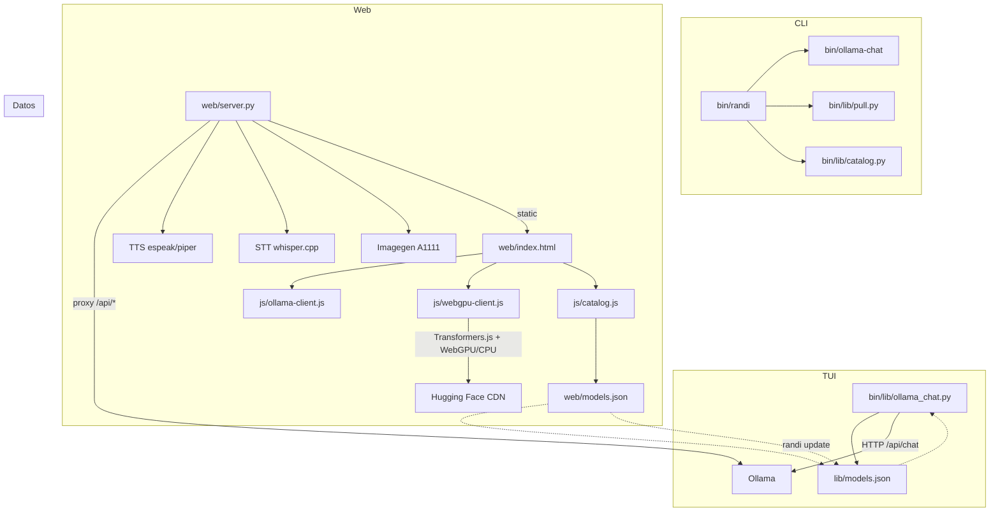

# Arquitectura de RANDI

RANDI es un asistente de IA local que orquesta Ollama desde tres superficies: una
CLI en bash, un chat TUI en Python (Rich) y una SPA web con doble backend
(Ollama + WebGPU/Transformers.js). No requiere red: todo corre en el dispositivo.

## Vista de componentes



## Modelo de datos

- `web/models.json` es la **unica fuente de verdad** del catalogo de modelos
  (25+ LLMs Ollama, 13 WebGPU, tools de vision/TTS/STT/imagegen). No se duplican
  listas en otro lugar.
- Consumidores: `bin/lib/catalog.py` (TUI/menues), `web/js/catalog.js` (web),
  `bin/lib/pull.py` (descargas). `randi update` copia el catalogo a
  `~/.local/share/randi/lib/models.json`.

## Flujos principales

### `randi chat`
```
bin/randi  ->  python3 ollama_chat.py -m <modelo>
  -> POST /api/chat (stream NDJSON) -> Ollama
  -> render Rich (Live + Markdown) -> sesiones en ~/.config/randi/sessions
```

### `randi web`
```
bin/randi web  ->  python3 web/server.py (127.0.0.1:8080-8099)
  -> sirve SPA + proxy /api/* a OLLAMA_HOST
  -> TTS/STT/imagegen resuelven herramientas locales si existen
  -> el navegador elige backend: Ollama (proxy) o WebGPU (Transformers.js en GPU)
```

## Decisiones de arquitectura (ADR)

### ADR-001: SPA vanilla JS con ES modules (sin framework)

- **Contexto**: el frontend debe correr offline en dispositivos de 4-8GB sin
  build step, servirse desde `SimpleHTTPRequestHandler` y cachearse con un
  service worker.
- **Decision**: mantener **vanilla JS + ES modules**, sin bundler ni framework.
  Solo dependencias CDN: `marked` (markdown) y Transformers.js (import dinamico).
- **Alternativas descartadas**: React/Next.js (exige build, peso innecesario para
  una SPA local); lit/svelte (nuevo toolchain, overkill).
- **Trade-offs**: el DOM es fuente de verdad de los mensajes; se usa `innerHTML`
  para render dinamico (ver `sanitizeHtml` en `chat-ui.js`). Requiere disciplina
  en la sanitizacion de salida del LLM.
- **Consecuencias**: `app.js` (895 l), `chat-ui.js` (630 l) y `ollama_chat.py`
  (848 l) superan el umbral de mantenibilidad. Refactor propuesto: extraer de
  `chat-ui.js` el render de mensajes (markdown + sanitizacion) a un modulo
  `render.js`, y de `app.js` los modales/sesiones a modulos dedicados.

### ADR-002: servidor web enlazado a localhost con origen validado

- **Contexto**: `server.py` es un proxy inverso hacia Ollama. Antes enlazaba en
  `0.0.0.0` con CORS `*`, lo que permitia a cualquier pagina web usar el proxy
  como tunel (CSRF/SSRF) y a equipos de la LAN acceder sin autenticacion.
- **Decision**: enlazar solo en `127.0.0.1`, validar `Host` (anti DNS rebinding),
  validar `Origin` en peticiones de estado, eliminar CORS `*`, y soportar un
  token opcional `RANDI_TOKEN` via cabecera `X-RANDI-Token` (inyectado en la SPA
  como `<meta name="randi-token">`).
- **Trade-offs**: se pierde el acceso remoto por LAN (no documentado como feature).

### ADR-003: catalogo centralizado en JSON

- **Contexto**: la lista de modelos aparecia duplicada en bash, TUI y web.
- **Decision**: un solo `models.json` consumido por `catalog.py`, `pull.py`,
  `catalog.js`. `***REMOVED***` (***REMOVED*** local) fija esta regla y el CI valida IDs
  unicos y campos obligatorios.

## Deuda tecnica conocida

Detectada por `***REMOVED***` del ***REMOVED*** `***REMOVED***`:

| Archivo | Lineas | Problema |
|---------|--------|----------|
| `web/js/app.js` | 895 | Orquestador demasiado grande |
| `web/js/chat-ui.js` | 630 | Render + comandos + TTS/STT mezclados |
| `bin/lib/ollama_chat.py` | 848 | `ChatSession` ~677 l: mezcla chat, sesiones, voz, vision |

Backlog priorizado en `docs/ROADMAP.md` / `CHANGELOG.md`.
